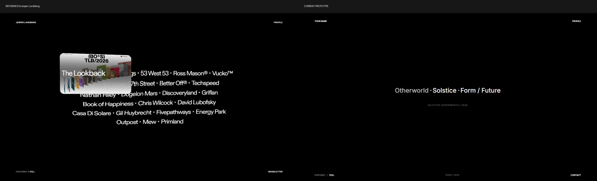
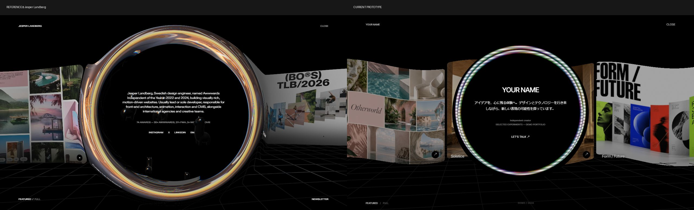
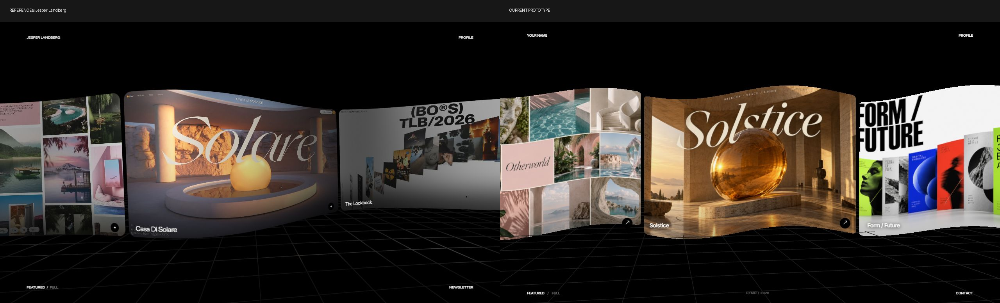
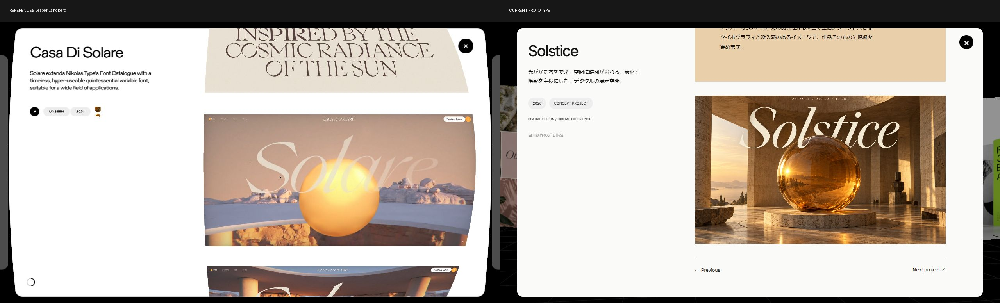

# Jesper参照と現行試作の再監査

2026-09-16。参照: https://jesperlandberg.com/ ／試作: http://127.0.0.1:4174/

## 結論

現行試作は、黒背景・カード・床・円という外形を近づけた段階に留まる。参照の品質を支えている「操作に応じる映像」「画面全体で整合する変形」「厚みと周囲との関係がある立体表現」が再現されていない。軽い数値調整だけでは埋まらない差がある。

前回の品質判断は甘かった。起動やリンクの動作確認と、参照に匹敵する視覚品質の確認を混同した。既存の design-qa.md の合格記録を、参照品質への到達を示すものとして扱うべきではない。本書が今回の視覚品質に関する評価となる。

## 今回の確認方法と範囲

両サイトを1280×720で実際に操作し、このフォルダに保存した25枚の新規スクリーンショットを比較した。古い evidence フォルダの画像は判定に使っていない。試作の Gallery.jsx、App.jsx、portfolio.css も読み、見えている差と実装を照合した。アプリコードは変更していない。

1. ギャラリー静止状態と再読み込み後を確認。
2. カード中央と矢印へポインターを移動して比較。
3. Profileを開き、リング右側へポインターを移動。
4. 作品詳細を開き、スクロール直後と停止後を比較。
5. Fullの通常状態、作品名へのホバー、同じ作品名内の移動、別作品への移動、領域外への離脱を確認。
6. ギャラリーへ戻りホイール操作を確認。

ポインター移動には座標指定のスクロール操作を移動量0で使用。カード中央についてはDOMの :hover 状態でも対象を確認した。動画撮影やフレーム単位の計測ではないため、遷移時間・FPS・入力遅延の数値評価はしていない。ドラッグ、モバイル、キーボード操作の網羅的な再検証は今回の範囲外。

## 優先度1：Fullのホバープレビューが丸ごと欠けている

**参照で確認:** 作品名にマウスを当てると角丸の映像カードが現れる。同じ作品名上でポインターを移動するとカードの位置・傾きが変わる。別作品へ移すと映像が切り替わり、領域外へ移すと縮小する途中の姿を確認できる。

**試作:** 文字の不透明度が0.7になるだけ。プレビューを作る要素も、ポインターに追従する処理もない。

**品質への影響:** 参照の一覧は「名前をなぞって作品を探索する場所」。試作は単なるテキストリンク集。同じ黒地の文字組みでも、使った瞬間の密度がまったく違う。

**改善の到達条件:** デモ素材を使い、表示開始・追従・作品間切り替え・離脱までを一続きで設計する。単にホバー画像を固定表示するだけでは不十分。

証拠: 09、10の両サイト／11〜13の参照。実装: App.jsx の full-index、portfolio.css の button:hover。

## 優先度1：Profileのリングが別物になっている

**参照で確認:** リングの外径は画面高の約9割。太い縁に明暗、複数の光沢帯、色の分離が見える。周囲のカードや床もリング付近で曲がり、内部では黒い立体物が移動する。

**試作:** 外径は画面高の約7割。細い虹色の二重線と黒い円。周囲の画像・床との光学的なつながりも内部の立体物もない。

**コード上の確認:** Portalは細いTorusGeometryを2個配置し、sin/cosで色を変えている。背景画像を読み取る処理や屈折のためのテクスチャ入力、マウス座標入力はない。

**品質への影響:** 参照では空間に大きな立体が現れたと感じる。試作ではページの上に装飾枠を載せたと感じる。輪の色や回転速度の調整だけでは解消できない。

**改善の到達条件:** 太さ・断面・光沢・周囲の歪み・内部オブジェクトをまとめて再構成する。参照がどの物理レンダリング方式を使うかは未確認であり、見た目から「本物の屈折計算」と断定はしない。また、内部物体の移動がマウス起因か自動再生かは今回の画像だけでは分離していない。

証拠: 04、05。実装: Gallery.jsx の Portal、portfolio.css の portal。

## 優先度1：曲がり方と文字・床の関係が揃っていない

**参照で確認:** カードの曲面に沿って作品名や矢印も配置され、背景と合わせた空間として見える。

**試作:** 画像を波打たせている一方、作品名と矢印は水平な別の矩形上に載る。画像の下辺が上下しても、ラベルの位置はそれに沿わない。床は別の単純なグリッドで、画像の揺れとの関係が薄い。

**コード上の確認:** 画像だけを頂点シェーダーで変形し、文字と矢印は投影中心と概算寸法から位置を決めるDOMボタンとして描く。ボタンの当たり判定も曲面に一致させたものではない。

**品質への影響:** 画像が柔らかい布のように動くのに、その上のUIが貼り付いてこない。これが「CG空間」より「画像にエフェクトを掛けたページ」に見える原因の一つ。

**改善の到達条件:** 画像・キャプション・ボタンの変形と座標、床の見え方を同じ規則で整合させる。DOMとWebGLの併用自体が問題なのではなく、表示位置と変形が一致していないことが問題。

証拠: 01〜03、14。実装: Gallery.jsx の vertex、button.style.transform、GridHelper。

## 優先度2：動きの理由が違う

**参照で確認:** カード内の映像が継続的に変わる。読み込まれたページアセットにも複数のmp4を確認。Fullでは実際のホバー操作に応じた変化を確認した。カード中央に置くだけで大きく変形する効果は、今回確認できなかった。

**試作:** 作品素材は静止PNG。代わりに画像自体が時間に応じてずっと波打つ。カード中央や矢印にホバーすると矢印が45度回るが、画像のうねりはポインターを外しても続く。

**コード上の確認:** uPhaseに経過時刻を与え続ける。ポインター移動はドラッグ中以外には画像の変形に反映されない。矢印の回転はCSS。

**品質への影響:** 参照の「作品の中で出来事が進む」魅力を、作品の外形を揺らす動きに置き換えてしまっている。静止画をきれいに作るだけでも、この差は埋まらない。

**改善の到達条件:** 自主制作の短いループ映像、またはシーン内のアニメーションを用意する。カードの変形はスクロール速度など入力に対応させ、静止時に落ち着く強さへ調整する。参照の演出をすべてホバー効果だと思い込んで増やさない。

## 優先度2：作品詳細で空間の一貫性が切れる

**参照で確認:** スクロール直後の白いシートと右側の画像がたわみ、停止後には直線的な状態へ戻る。左の説明は読み続けられる位置に留まる。

**試作:** 左列の固定はできている。ただし白いシートと画像は通常の矩形のままスクロールする。表示開始も一定の下移動・縮小・フェードで、選択したカード位置を使っていない。

**品質への影響:** トップの立体表現と詳細画面が異なる操作感になる。参照で保たれている柔らかな空間の感触が詳細で途切れる。

**改善の到達条件:** スクロール速度と変形を連動させ、停止時に収束させる。開閉の連続性も再設計する。ただし今回の取得間隔では参照の開閉モーフの全フレームは捉えられておらず、正確な軌道や所要時間の断定は保留。

証拠: 06〜08。実装: portfolio.css の sheet-in、project-sheet。

## 優先度2：作品を開いた後の見せる材料が不足

**参照:** 異なる画面、タイポグラフィ、動く作品画面が続く。

**試作:** 最初のPNG、説明用の色面、最初と同じPNGのトリミング。2枚目の画像で新たな内容を見せられていない。

**品質への影響:** 表紙だけを作って、中身を埋めた状態に見える。デモ作品でも、全体像・ディテール・動きの3つを用意すれば作品としての説得力を作れる。

**改善の到達条件:** 作品ごとに別カットと展開例を用意し、それぞれに見せる役割を与える。実績や受賞歴を架空に増やす必要はない。

## 優先度3：文字組み・情報密度・小さな操作の差

- Full: 参照は複数行の大きな文字の塊として成立。試作は3作品の1行で、中央の面積が小さい。単に同じ配置を当てはめると空白過多になる。3作品という前提に合わせた設計が必要。
- Profile: 参照は短い本文・実績・リンクのまとまり。試作は大きな名前見出しと分散したテキストで別の階層。名前が仮であることよりも、文字の大きさと段落間隔の組み立ての差が大きい。
- 詳細: 参照の右画像開始位置は約538px、試作は約499px。画像幅と左列との釣り合いが異なり、全体のプロポーションを変えている。
- カードのカーソル: 参照は pointer、試作は grab。ドラッグできる表現はあるが、クリックして開ける意味は参照より弱い。
- 試作の低コントラストな小さい補足文字は、実際に読ませる情報なら再調整が必要。今回はコントラスト比を測定していないため、規格適合・不適合の判定はしない。

## 修正順序

1. カード・文字・床を含む描画構造と、操作に応じる変形の規則を整える。
2. Fullのホバープレビューを実装し、追従・切り替え・離脱まで詰める。
3. Profileの立体表現を作り直す。
4. デモ作品の映像と複数カットを用意し、詳細のスクロール演出を整える。
5. 最後に文字組み、列幅、余白、明暗、カーソルを調整する。

最初にフォントや色だけを調整しても、大きな不足は残る。次回の合格基準は、同じ操作の前・途中・後を並べ、表示だけでなく反応と収束まで比較すること。

## 留保

開始時に試作のカード輪郭が大きく階段状に見える状態を一度観察したが、再読み込みで軽減した。比較用の保存証拠と再現条件が揃っていないため、確定した恒常不具合としては扱わない。長時間稼働後の再現確認が必要。

画面取得の時間差があるため、動的な素材の同一フレーム比較ではない。capture-log.json の時刻は保存時刻であり、操作からの厳密な経過時間ではない。参照コード内部の描画方式やパフォーマンス優劣は断定していない。
