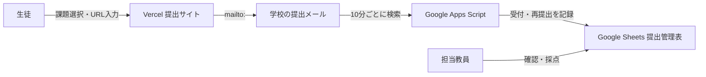

# 仕組み

## 全体像

## 役割分担

- **Vercel / `app/`**: 生徒に見せる提出サイト。個人情報を保存せず、既定のメールアプリを開くだけ。
- **Gmail**: 生徒からの正式な提出窓口。件名と本文のURLで提出内容を受け取る。
- **Apps Script / `apps-script/`**: Gmailの提出メールを定期監視する。GmailとSheetsの認可は運用担当Googleアカウントだけが持つ。
- **Google Sheets**: 提出一覧、再提出回数、エラー、要確認メールを管理する教員用台帳。

## 重複・再提出の扱い

1. 同じGmail message IDは `_受信台帳` により一度だけ処理する。
2. 同じ `課題ID + 学籍番号` なら、`提出一覧` の行を最新URL・最新日時で更新する。
3. その場合、`再提出回数` を加算する。
4. 件名・URL・許可ドメインが不正なものは `要確認` に記録し、提出一覧へは登録しない。

## 変更時の対応表

| 変更したいこと | 変更場所 |
| --- | --- |
| カードの課題名・説明 | `app/src/content.js` |
| 提出画面の文言・入力項目 | `app/src/App.jsx` |
| 見た目 | `app/src/portfolio.css` |
| 提出先メール | Vercelの `VITE_SUBMISSION_TO` |
| 課題ID・受付状態 | Google Sheets の `PBL課題一覧` と `app/src/content.js` |
| 送信元メールの制限 | Apps Script Properties の `ALLOWED_SENDER_DOMAIN` |
| Gmail監視頻度 | `apps-script/Code.gs` の `everyMinutes(10)` |
